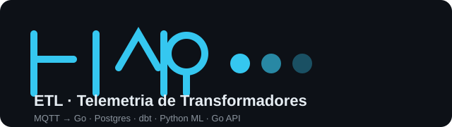

# ETL Telemetria de Transformadores

<p align="center">
  
</p>

Plataforma de dados e backend que simula transformadores de potência e o
fluxo completo de telemetria — **MQTT → ingestion → Postgres → dbt → ML →
API** — inspirada em arquiteturas públicas de monitoramento de
transformadores (Siemens Energy: Noedra Node, Sensformer, SITRAM).

> **Projeto educacional.** Todos os dados são sintéticos, gerados por
> simulador. Nenhum sistema proprietário é reproduzido e nenhum dado real
> de fabricante está presente.

## Problem

Operação de ativos de energia (subestações, parques) depende de telemetria
confiável e de histórico estruturado de engenharia. Transformadores são o
ativo mais caro de uma subestação; monitorá-los exige um pipeline contínuo
(sensor/campo → transporte → validação → armazenamento → análise/ML →
consulta) e suportar decisões de **similaridade entre projetos** e
**detecção antecipada de anomalias**.

Este repositório entrega uma plataforma completa, **sintética e local**,
que percorre esse arco de ponta a ponta com sistemas de mercado
(Go, Postgres, MQTT, dbt) sem acoplar a nenhuma nuvem.

## Domain

Transformador de potência: `transformer_id`, `rated_power_mva`,
`hv_voltage_kv`, `lv_voltage_kv`, `frequency_hz`, `phase_count`,
`vector_group`, `impedance_percent`, `cooling_type`,
`commissioning_year`, `application` — mais atributos de design
(losses, massa, dimensões). Formam a **base histórica de projetos** do
mecanismo de similaridade.

Telemetria: `timestamp`, `load_percent`, `ambient_temperature_c`,
`oil_temperature_c`, `winding_temperature_c`, `oil_level_percent`,
`current_a`, `voltage_kv`. Relações físicas (carga ↑ → temperatura do
enrolamento ↑ → temperatura do óleo ↑; ambiente ↑ → óleo ↑), estados
`NORMAL`/`WARNING`/`CRITICAL`. Detalhes em [docs/domain.md](docs/domain.md)
e [docs/telemetry-model.md](docs/telemetry-model.md).

## Arquitetura

```text
                    TRANSFORMER SIMULATOR (Go)
                            |
                            | telemetry (MQTT)
                            v
                    GO INGESTION SERVICE
                            |
                            v
                BRONZE: raw telemetry (Postgres)
                            |
                            v
                 dbt SILVER: validated/curated
                            |
                            v
                   dbt GOLD: dimensional model
                            |
                            v
                     PYTHON ML SERVICE
                            |
             +------+------+
             |             |
             v             v
        Similarity      Anomaly
             |             |
             +------+------+
                    |
                    v
                  GO API
```

- **Pressão**: MQTT (broker) desacopla, ingestion é a fronteira de
  validação, dbt orquestra silver/gold (SQL-first), ML é stateless e a API é
  a superfície de consulta.
- **Decisões arquiteturais**: [docs/adr/](docs/adr/) (Go como linguagem
  principal, MQTT, dbt, Postgres, plataformas excluídas, dados sintéticos,
  async skip).
- **Emulação Siemens Energy**: [docs/siemens-emulation.md](docs/siemens-emulation.md).

## Data model

- **Operacional (Postgres)**: `transformers`, `measurements`, `events`,
  `maintenance` — modelo normalizado para ingestão e consulta OLTP.
- **Bronze**: `raw_telemetry`/`raw_events` — payload original verbatim
  (JSONB) + `source`, `ingested_at`, `schema_version` para replay/auditoria.
- **Silver (dbt)**: `stg_telemetry` (validação, dedup, normalização de
  timestamp/unidades, qualidade) e `int_telemetry` (campos derivados:
  `thermal_stress_index`, margens, `state_recomputed`).
- **Gold (dbt, star schema)**: `dim_time`, `dim_transformer`,
  `dim_location`, `dim_sensor` + `fact_transformer_measurement` e
  `fact_transformer_event`.

Detalhes em [docs/data-model.md](docs/data-model.md),
[docs/postgres.md](docs/postgres.md), [docs/raw-data.md](docs/raw-data.md),
[docs/elt.md](docs/elt.md) e [docs/dimensional-model.md](docs/dimensional-model.md).

## Telemetry model

Contrato versionado (`schema_version`), payload único para
`transformers/{id}/telemetry` via MQTT QoS 1. Medições normalizadas com
unidades consistentes; estado recomputado na ingestão (guardião — nunca
confia no emissor). Detalhes em
[docs/telemetry-contract.md](docs/telemetry-contract.md) e
[docs/mqtt.md](docs/mqtt.md).

## ETL pipeline

1. Ingestion (Go): assina `transformers/{id}/telemetry`, valida
   (schema, registro, faixa física, estado, timestamp), normaliza,
   deduplica por `{transformer_id}@timestamp` e grava bronze.
2. dbt silver: extrai/valida/deduplica/normaliza e deriva campos
   (`thermal_stress_index`). 20 testes de dados.
3. dbt gold: star schema analítico. 25 testes de dados (chaves, FKs,
   enums) e consultas de drill-down.
4. Backfill: `cmd/backfill` rejoga dumps JSONL na bronze (auditoria/replay).

## ML approach

Serviço Python stateless (stdlib `http.server`, sem framework):

- **Features**: scaling (`StandardScaler`) sobre atributos de design.
- **Similarity**: baseline Euclidiana normalizada em features escaladas,
  score em `[0,1]` (sem LLM), ordem descendente.
- **Anomaly**: `IsolationForest` sobre telemetria.

Rotas: `GET /health`, `POST /similar`, `POST /anomaly`. 12 testes pytest.
Detalhes em [docs/ml-service.md](docs/ml-service.md) e
[docs/similarity.md](docs/similarity.md).

## API

`GET /health`, `GET /livez`, `GET /readyz`, `GET /metrics`,
`GET /transformers` (paginação), `POST /transformers`,
`GET /transformers/{id}`, `.../{id}/telemetry`, `.../{id}/events`,
`.../{id}/similar`, `.../{id}/statistics`.

Request IDs, logs JSON, envelope de erro `{error:{code,message}}` e
métricas Prometheus. Detalhes em [docs/api.md](docs/api.md),
[docs/api-contracts.md](docs/api-contracts.md) e
[docs/observability.md](docs/observability.md).

## Local development

Requisitos: Go 1.26+, Python 3.11+ (venv), Docker, make, psql.

```sh
make build && make test      # Go: compila e testa (unit)
make seed                    # regenera dbt/seeds/transformers.csv (frota sintética)
make db && make migrate      # Postgres local + migrations goose
make ml-run &                # serviço ML em :8081
make api &                   # API em :8080
make smoke                   # fim a fim curto (broker+simulador+ingestion)
make demo                    # COMPOSE: stack completa (postgres/mqtt/ml/ingestion/api) + simular + dbt
```

Compose: `docker compose up -d` (sempre-on: postgres, mosquitto, ml,
ingestion, api) + jobs `docker compose run --rm simulator` e `dbt`.
Portas: 5432, 1883, 8080, 8081.

## Notebooks (portfólio)

Cinco notebooks "finos" (`notebooks/`) mapeando os requisitos da vaga
(Inova Talentos / Siemens Energy), reutilizando os módulos e serviços
reais do projeto — nada de Data Science disfarçado (AGENTS.md):

| Notebook | Requisito |
|---|---|
| `01_historical_base.ipynb` | Estruturar e preparar bases históricas |
| `02_sql_pipeline.ipynb` | Consultas SQL e pipelines (bronze→silver→gold) |
| `03_integrations.ipynb` | Integrações banco ↔ API ↔ plataformas |
| `04_similarity.ipynb` | Mecanismo de similaridade entre projetos |
| `05_ml_services.ipynb` | Serviços de IA (similaridade + anomalia) |

```sh
make jupyter-deps        # deps do notebook (uma vez)
make nb-build            # regenera os .ipynb a partir de build_notebooks.py
make nb-run              # executa todos headless (precisa db, ml-run, api)
make jupyter             # abre Jupyter Lab
```

Os notebooks importam `notebooks/common.py` e os serviços `ml_service`,
Go API e PostgreSQL já em execução (subir com `make ml-run` e `make api`
ou `docker compose up -d`).

## Testing

- Go unit (domain, telemetry, messaging, ingestion, ml).
- Go integração gated por `TEST_DATABASE_URL` (migrate, store, API contra
  Postgres real via httptest): `make test-db`, `make api-test`.
- Python: 12 testes pytest do ML (`make ml-test`).
- E2E automatizado MQTT→ingestion→PostgreSQL→dbt silver (`make e2e`).
- Dados: silver 20 testes, gold 25 testes (dbt).

Detalhes em [docs/testing.md](docs/testing.md).

## Azure

Mapeamento local→Azure documentado (IoT Hub, Event Hubs, ADLS Gen2,
Postgres Flexible, Container Apps, Snowflake/Databricks) — **só
documentação**, nada depende de nuvem hoje. Contratos e payloads
mantidos. Detalhes em [docs/azure.md](docs/azure.md).

## Requisitos da vaga

Mapeamento com o cargo (Bolsista TECH, Siemens Energy Jundiaí) em
[docs/siemens-emulation.md](docs/siemens-emulation.md): bases históricas
(Phase 1/5/6), consultas SQL e pipelines (Phase 7/8), integrações
banco/API/plataformas (Phase 3–6, 11), similaridade (Phase 10) e
serviços de IA (Phase 9/11).

## Limitations

- Dados 100% sintéticos (simulador) — padrões ML derivados não se aplicam
  a dados reais sem retreino/avaliação.
- Falta produtor de eventos (fase opcional) e alerting/notificação.
- Similaridade é baseline Euclidiana (sem modelos de embedding/LLM),
  suficiente para demonstrar o serviço.
- Sem autenticação/autorização na API (ambiente educacional local).
- dbt silver/gold escritos para Postgres; migração para
  Snowflake/Databricks exige revisão de SQL específico (documentado no
  Azure mapping).

## Síntese das fases

Entregue incrementalmente, uma fase por vez, avançando após aprovação.
Estado completo (Fase 3 → 16 em `## Estado` abaixo); lista de fases em
`AGENTS.md`.

## Documentação técnica

- [docs/architecture.md](docs/architecture.md) · [docs/domain.md](docs/domain.md)
- [docs/data-model.md](docs/data-model.md) · [docs/postgres.md](docs/postgres.md)
- [docs/raw-data.md](docs/raw-data.md) · [docs/elt.md](docs/elt.md) · [docs/dimensional-model.md](docs/dimensional-model.md)
- [docs/telemetry-contract.md](docs/telemetry-contract.md) · [docs/telemetry-model.md](docs/telemetry-model.md)
- [docs/mqtt.md](docs/mqtt.md) · [docs/ingestion.md](docs/ingestion.md)
- [docs/ml-service.md](docs/ml-service.md) · [docs/similarity.md](docs/similarity.md)
- [docs/api.md](docs/api.md) · [docs/api-contracts.md](docs/api-contracts.md)
- [docs/observability.md](docs/observability.md) · [docs/testing.md](docs/testing.md)
- [docs/compose.md](docs/compose.md) · [docs/azure.md](docs/azure.md)
- [docs/siemens-emulation.md](docs/siemens-emulation.md) · [docs/adr/](docs/adr/)

## Estado

**Fase 3 — Event ingestion (MQTT): DONE.** Simulador publica telemetria no
tópico `transformers/{id}/telemetry` (QoS 1, payload versionado) via broker
Mosquitto local. Tópicos e helpers em `internal/messaging`.

**Fase 4 — Ingestion service (Go): DONE.** Serviço assina
`transformers/+/telemetry`, valida (schema, registro, faixas físicas,
estado, timestamp), normaliza (recomputa `state`), deduplica por
`{id}@{timestamp}` e persiste bronze (JSONL: raw provenance + measurement
normalizada). Logs JSON estruturados, métricas básicas e shutdown
gracioso. Detalhes em [docs/ingestion.md](docs/ingestion.md).

**Fase 5 — PostgreSQL: DONE.** Modelo operacional normalizado
(`transformers`, `measurements`, `events`, `maintenance`) com migrations
goose (SQL, nada auto-gerado), CLI `cmd/dbmigrate`, camada de conexão
pgx em `internal/store` e teste de integração (gateado por
`TEST_DATABASE_URL`). Detalhes em [docs/postgres.md](docs/postgres.md).

**Fase 6 — Raw historical data: DONE.** Camada bronze persistida no
Postgres: `raw_telemetry`/`raw_events` (payload original verbatim em
JSONB, ingestão idempotente por chave natural), store de ingestão PG
(`internal/store`), seeding do registro a partir do CSV e conector de
backfill `cmd/backfill` para replay/auditoria de dumps JSONL. Detalhes em
[docs/raw-data.md](docs/raw-data.md).

**Fase 7 — ETL/ELT (bronze→silver): DONE.** Pipeline dbt reproduzível:
`stg_telemetry` (extrai payload JSONB, valida, deduplica por chave
natural, normaliza timestamp/unidades, marca qualidade) e
`int_telemetry` (campos derivados: `thermal_stress_index`, margens de
temperatura, `state_recomputed`). 20 testes de dados (schema + singulares)
passam. Detalhes em [docs/elt.md](docs/elt.md).

**Fase 8 — Dimensional model (gold): DONE.** Star schema: `dim_time`,
`dim_transformer`, `dim_location` (sintético, determinístico) e
`dim_sensor` + `fact_transformer_measurement` e `fact_transformer_event`
(eventos ainda sem produtor). 25 testes de dados passam. Consultas
analíticas (drill-down região/aplicação) funcionando. Detalhes em
[docs/dimensional-model.md](docs/dimensional-model.md).

**Fase 9/10 — Python ML service + Similarity: DONE.** Serviço Python
stateless (http.server, sem framework): `features` (StandardScaler sobre
features de design), `similarity` (baseline Euclidiana normalizada, sem
LLM, score em [0,1]) e `anomaly` (IsolationForest). Rotas `GET /health`,
`POST /similar`, `POST /anomaly`. 12 testes pytest passam. Detalhes em
[docs/ml-service.md](docs/ml-service.md) e
[docs/similarity.md](docs/similarity.md).

**Fase 11 — Go API: DONE.** API REST (`cmd/api` + `internal/api`) com
rotas: `GET /health`, `GET /transformers`, `POST /transformers`,
`GET /transformers/{id}`, `.../{id}/telemetry`, `.../{id}/events`,
`.../{id}/similar` (delega ao serviço ML), `.../{id}/statistics`.
`X-Request-Id`, logs JSON, paginação com `X-Total-Count`, respostas de
erro em envelope `{error: {code, message}}` e interfaces (`Store`,
`SimilarityClient`) para teste sem banco. Detalhes em
[docs/api.md](docs/api.md).

**Fase 12 — Async processing: SKIPPED (documentado).** Avaliado e
registrado em
[docs/adr/ADR-0007-skip-async-processing.md](docs/adr/ADR-0007-skip-async-processing.md):
ingestão já é assíncrona via MQTT (QoS 1), ELT é batch (dbt), serviço ML é
stateless/rápido e não há workload longo. Sem Redis/queue/workers.

**Fase 13 — Observability: DONE.** Logs estruturados JSON + `X-Request-Id`
(correlação), métricas Prometheus em `GET /metrics`
(`http_requests_total`, `http_request_duration_seconds`) e probes de
liveness (`/livez`) e readiness (`/readyz`, checa DB). Detalhes em
[docs/observability.md](docs/observability.md).

**Fase 14 — Tests: DONE.** Go unit (domain, telemetry, messaging,
ingestion, ml) e integração gated por `TEST_DATABASE_URL` (migrate, store,
API contra Postgres real via httptest), 12 testes pytest do ML e E2E
automatizado MQTT→ingestion→PostgreSQL→dbt silver (`scripts/e2e.sh` /
`make e2e`). Detalhes em [docs/testing.md](docs/testing.md).

**Fase 15 — Docker Compose: DONE.** `docker-compose.yml` sobe a plataforma
toda (postgres, mosquitto, ml, ingestion, api + jobs simulator/dbt),
`make demo` orquestra build→up→simulate→dbt→amostra da API. Dockerfiles
Go multi-stage, ML e dbt; healthchecks em todos os serviços. Verificado:
5 serviços healthy, frota de 40 transformadores, dbt 45 PASS. Detalhes em
[docs/compose.md](docs/compose.md).

**Fase 16 — Azure: DONE (documentação).** Mapeamento local→Azure
(IoT Hub, Event Hubs, ADLS, Postgres Flexible, Container Apps,
Snowflake/Databricks) sem qualquer dependência de nuvem hoje. Contratos e
payloads são preservados; dbt e API são portáveis. Detalhes em
[docs/azure.md](docs/azure.md).

## Execução

- `make build` / `make test` — compila e roda os testes Go.
- `make seed` — regenera a base histórica sintética (`dbt/seeds/transformers.csv`).
- `make simulate` — dry run curto de telemetria no stdout (sem broker).
- `make mqtt-broker` + `make publish` — sobe o Mosquitto e publica telemetria.
- `make ingest` — roda o ingestion (bronze JSONL em `data/bronze.jsonl`).
- `make smoke` — loop fim a fim curto (broker+simulador+ingestion).
- `make db` / `make migrate` / `make test-db` — Postgres local, migrations goose e teste de integração.
- `make demo` / `demo-up` / `demo-down` — plataforma completa via Docker Compose.